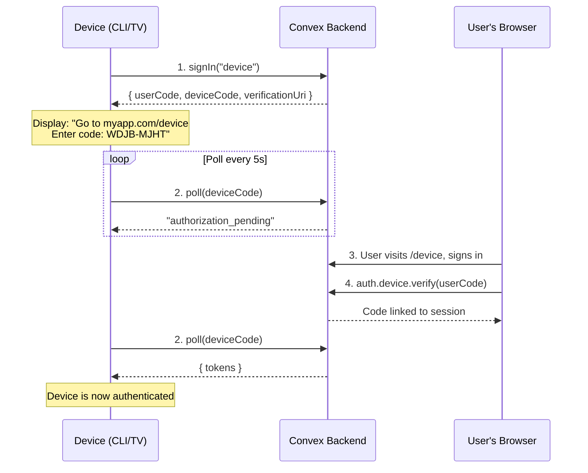
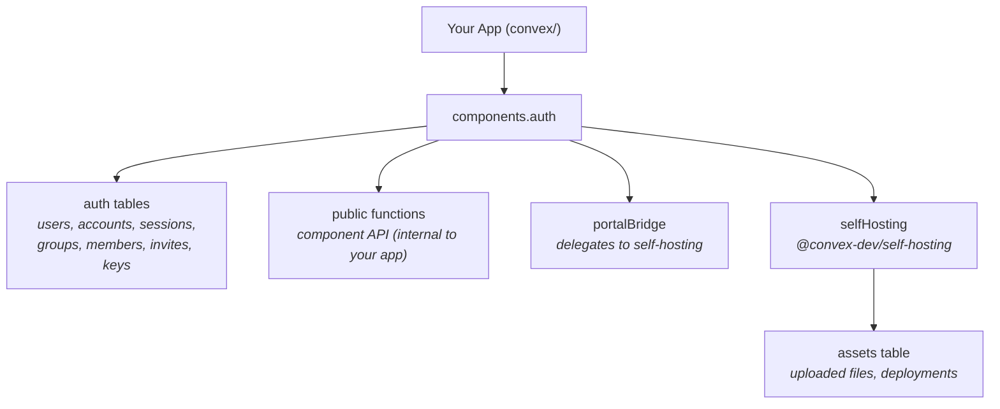
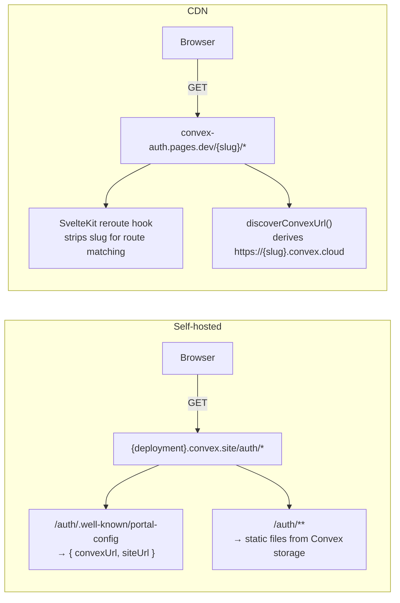

# @robelest/convex-auth

Component-first authentication for [Convex](https://convex.dev). One component, one class, full TypeScript support.

- **Class-based API** — `new Auth(components.auth, { providers })` gives you everything: auth, portal, helpers.
- **Built-in admin portal** — A dark-themed SvelteKit dashboard served directly from your Convex deployment. Manage users, sessions, and invites. No separate hosting.
- **Self-hosting as a sub-component** — Portal static files are stored and served through an embedded `@convex-dev/self-hosting` sub-component. You install one component, not two.
- **Groups, memberships, invites** — Hierarchical groups with roles, atomic invite acceptance, and cascade deletes.
- **Passkeys, TOTP, password, OAuth, magic links, OTP, phone, anonymous** — All built in.

## Install

```bash
npm install @robelest/convex-auth
```

## Quick Setup (CLI)

```bash
npx @robelest/convex-auth
```

The interactive setup wizard runs 6 steps:

1. **Configure `SITE_URL`** — auto-detects your framework (Vite `:5173`, Next.js `:3000`, etc.)
2. **Generate key pair** — creates RS256 `JWT_PRIVATE_KEY` and `JWKS`, sets them on your deployment
3. **Configure `tsconfig.json`** — sets `moduleResolution: "Bundler"` and `skipLibCheck: true`
4. **Create `convex/convex.config.ts`** — registers the auth component with `app.use(auth)`
5. **Create `convex/auth.ts`** — scaffolds `new Auth(components.auth, { providers })` with `Portal()` exports
6. **Create `convex/http.ts`** — wires up `auth.http.add(http)` for OAuth callbacks, JWKS, and portal serving

Pass `--site-url` to skip the URL prompt:

```bash
npx @robelest/convex-auth --site-url "http://localhost:5173"
```

## Manual Setup

Three files. That's it.

### 1. Register the component

```ts
// convex/convex.config.ts
import { defineApp } from "convex/server";
import auth from "@robelest/convex-auth/convex.config";

const app = defineApp();
app.use(auth);

export default app;
```

### 2. Configure auth

```ts
// convex/auth.ts
import { Auth, Portal } from "@robelest/convex-auth/component";
import { components } from "./_generated/api";
import { GitHub } from "arctic";
import { OAuth } from "@robelest/convex-auth/providers";

const auth = new Auth(components.auth, {
  providers: [
    OAuth(new GitHub(process.env.AUTH_GITHUB_ID!, process.env.AUTH_GITHUB_SECRET!)),
  ],
});

export { auth };
export const { signIn, signOut, store } = auth;
export const { portalQuery, portalMutation, portalInternal } = Portal(auth);
```

`Auth` wraps auth actions and helper accessors. `Portal()` creates the portal admin function definitions — a separate call because Convex's bundler needs plain function returns to recognize exported function definitions.

### 3. Wire up HTTP routes

```ts
// convex/http.ts
import { httpRouter } from "convex/server";
import { auth } from "./auth";

const http = httpRouter();
auth.http.add(http);

export default http;
```

`auth.http.add` registers OAuth callbacks, JWKS endpoints, and portal static file serving in one call.

## Context Enrichment (`AuthCtx`)

Eliminate per-handler auth boilerplate with `AuthCtx`. Set up once, and every query/mutation gets `ctx.auth.userId` and `ctx.auth.user` automatically.

Requires [`convex-helpers`](https://github.com/get-convex/convex-helpers) (`bun add convex-helpers`).

### Setup

```ts
// convex/functions.ts
import { customQuery, customMutation } from "convex-helpers/server/customFunctions";
import { query as rawQuery, mutation as rawMutation } from "./_generated/server";
import { AuthCtx } from "@robelest/convex-auth/component";
import { auth } from "./auth";

const authCtx = AuthCtx(auth);

export const query = customQuery(rawQuery, authCtx);
export const mutation = customMutation(rawMutation, authCtx);
```

### Usage

Import `query` and `mutation` from `./functions` instead of `./_generated/server`:

```ts
// convex/messages.ts
import { query, mutation } from "./functions";

export const list = query({
  args: {},
  handler: async (ctx) => {
    // ctx.auth.userId — authenticated user ID (throws if not signed in)
    // ctx.auth.user   — full user document
    return ctx.db.query("messages").collect();
  },
});

export const send = mutation({
  args: { body: v.string() },
  handler: async (ctx, { body }) => {
    await ctx.db.insert("messages", { body, userId: ctx.auth.userId });
  },
});
```

### Optional auth (public routes)

```ts
// convex/functions.ts
export const publicQuery = customQuery(rawQuery, AuthCtx(auth, { optional: true }));
// ctx.auth.userId is null when unauthenticated, no error thrown
```

### Multi-tenant with group resolution

```ts
// convex/functions.ts
const authCtx = AuthCtx(auth, {
  resolve: async (ctx, user) => {
    const groupId = user?.extend?.lastActiveGroup;
    const membership = await auth.user.group.get(ctx, { userId: user._id, groupId });
    return { groupId, role: membership?.role ?? "member" };
  },
});

export const query = customQuery(rawQuery, authCtx);
// ctx.auth.groupId and ctx.auth.role available in all handlers
```

### Composing with triggers

`AuthCtx` returns a standard `{ args, input }` customization object, so it composes with other `convex-helpers` patterns:

```ts
import { Triggers } from "convex-helpers/server/triggers";

const triggers = new Triggers<DataModel>();
triggers.register("messages", async (ctx, change) => { /* ... */ });

const triggeredMutation = customMutation(rawMutation, customCtx(triggers.wrapDB));
export const mutation = customMutation(triggeredMutation, AuthCtx(auth));
```

### What's on `ctx.auth`

| Property | Type | Description |
|----------|------|-------------|
| `userId` | `string` | Authenticated user's document ID |
| `user` | `object \| null` | Full user document from the auth component |
| `getUserIdentity()` | `Promise<UserIdentity \| null>` | Native Convex method (preserved) |
| `...extra` | varies | Whatever `resolve()` returns (e.g. `groupId`, `role`) |

With `{ optional: true }`, `userId` and `user` are `null` when unauthenticated instead of throwing.

## Direct API Usage

For fine-grained control or when calling non-user methods (`auth.group.*`, `auth.key.*`, etc.), use `auth.*` helpers directly:

```ts
import { query, mutation } from "./_generated/server";
import { auth } from "./auth";

export const viewer = query({
  args: {},
  handler: async (ctx) => {
    const userId = await auth.user.require(ctx);
    return await auth.user.get(ctx, userId);
  },
});

export const updateProfile = mutation({
  args: { name: v.string() },
  handler: async (ctx, { name }) => {
    const userId = await auth.user.require(ctx);
    // ... your logic
  },
});
```

### Auth helpers

| Helper | Returns |
|--------|---------|
| `auth.user.current(ctx)` | User ID or `null` |
| `auth.user.require(ctx)` | User ID (throws if not signed in) |
| `auth.user.get(ctx, userId)` | User document |
| `auth.user.patch(ctx, userId, data)` | Update user with partial data |
| `auth.user.viewer(ctx)` | Current user's document |

### Groups and memberships

Hierarchical groups with application-defined roles. Groups, memberships, and invites each have an optional `extend` JSON field for app-specific data.

Groups support first-class **tags** for faceted classification/filtering. Tags are `{ key, value }` pairs normalized at write time (trimmed + lowercased). Use `slug` for canonical identity/URLs and tags for classification (location, service, department, etc.).

```ts
const groupId = await auth.group.create(ctx, {
  name: "Acme Corp",
  tags: [
    { key: "location", value: "NYC" },
    { key: "tier", value: "enterprise" },
  ],
  extend: { billingPlan: "pro" },
});

await auth.group.member.add(ctx, {
  groupId,
  userId,
  role: "owner",
  status: "active",
});

// Filter by tags — strict exact match on normalized (key, value)
const { items } = await auth.group.list(ctx, {
  where: {
    tagsAll: [{ key: "location", value: "nyc" }],       // must have ALL
    tagsAny: [{ key: "tier", value: "enterprise" },
              { key: "tier", value: "pro" }],            // must have at least ONE
  },
});

// Update tags (replace semantics — omit to leave unchanged, [] to clear)
await auth.group.update(ctx, groupId, {
  tags: [{ key: "location", value: "SF" }],
});
```

| API | Description |
|-----|-------------|
| `auth.group.create(ctx, data)` | Create a group (accepts optional `tags`) |
| `auth.group.get(ctx, groupId)` | Get a group |
| `auth.group.list(ctx, { where?, limit?, cursor?, orderBy?, order? })` | List groups (supports `tagsAll`/`tagsAny` in `where`) |
| `auth.group.update(ctx, groupId, data)` | Update a group (include `tags` to replace tag set) |
| `auth.group.delete(ctx, groupId)` | Delete group + cascade members/invites/tags |
| `auth.group.member.add(ctx, data)` | Add membership |
| `auth.group.member.list(ctx, { where?, limit?, cursor?, orderBy?, order? })` | List members |
| `auth.group.member.update(ctx, memberId, data)` | Update role/status |
| `auth.group.member.remove(ctx, memberId)` | Remove membership |
| `auth.user.group.list(ctx, { userId, limit?, cursor? })` | List user's memberships |
| `auth.user.group.get(ctx, { userId, groupId })` | Get user's membership in a group |

All list methods return `{ items, nextCursor }`. Pass `nextCursor` back as `cursor` for the next page.

### Invites

Platform-level invite records with statuses: `pending`, `accepted`, `revoked`, `expired`.

```ts
const inviteId = await auth.invite.create(ctx, {
  groupId,
  invitedByUserId: userId,
  email: "new@example.com",
  tokenHash: "hashed-token",
  status: "pending",
  expiresTime: Date.now() + 86_400_000,
  role: "member",
});
```

Atomic accept + membership creation in a single mutation:

```ts
await auth.invite.accept(ctx, inviteId);
if (invite.groupId) {
  await auth.group.member.add(ctx, {
    groupId: invite.groupId,
    userId,
    role: invite.role,
  });
}
```

| API | Description |
|-----|-------------|
| `auth.invite.create(ctx, data)` | Create an invite |
| `auth.invite.get(ctx, inviteId)` | Get an invite |
| `auth.invite.list(ctx, { where?, limit?, cursor?, orderBy?, order? })` | List invites |
| `auth.invite.accept(ctx, inviteId)` | Accept (pending only) |
| `auth.invite.revoke(ctx, inviteId)` | Revoke (pending only) |

Error codes: `DUPLICATE_MEMBERSHIP`, `DUPLICATE_INVITE`, `INVITE_NOT_FOUND`, `INVITE_NOT_PENDING`.

### API Keys

Programmatic access with scoped permissions, SHA-256 hashed storage, and optional per-key rate limiting.

```ts
// Create a key
const { keyId, raw } = await auth.key.create(ctx, {
  userId,
  name: "CI Pipeline",
  scopes: [{ resource: "users", actions: ["read", "list"] }],
});
// raw = "cvx_abc123..." — show once, never stored

// Verify a key from a request
const key = await auth.key.verify(ctx, bearerToken);
// key = { userId, scopes, ... } or null
```

| API | Description |
|-----|-------------|
| `auth.key.create(ctx, data)` | Create a key (returns raw key + ID) |
| `auth.key.verify(ctx, rawKey)` | Verify and return key record (or null) |
| `auth.key.list(ctx, { where?, limit?, cursor?, orderBy?, order? })` | List keys |
| `auth.key.get(ctx, keyId)` | Get a key by ID |
| `auth.key.update(ctx, keyId, data)` | Update name, scopes, rate limit |
| `auth.key.revoke(ctx, keyId)` | Revoke a key (soft delete) |
| `auth.key.remove(ctx, keyId)` | Permanently delete a key |

Keys support wildcard scopes (`{ resource: "*", actions: ["*"] }`) and optional token-bucket rate limiting via `rateLimit: { maxTokens, refillRate }`.

### Bearer Token Auth (`auth.http`)

Expose HTTP endpoints authenticated via API key with zero boilerplate. `auth.http.route()` handles Bearer token extraction, key verification, CORS (including OPTIONS preflight), scope checking, and structured JSON error responses.

#### Quick example

```ts
// convex/http.ts
import { httpRouter } from "convex/server";
import { internal } from "./_generated/api";
import { auth } from "./auth";

const http = httpRouter();
auth.http.add(http);

auth.http.route(http, {
  path: "/api/messages",
  method: "POST",
  handler: async (ctx, request) => {
    const { body } = await request.json();
    await ctx.runMutation(internal.messages.sendAsUser, {
      userId: ctx.key.userId,
      body,
    });
    return { success: true };
  },
});

export default http;
```

That replaces ~30 lines of manual Bearer parsing, try/catch, and CORS headers per endpoint.

#### What's on `ctx.key`

| Property | Type | Description |
|----------|------|-------------|
| `userId` | `string` | Owner of the verified API key |
| `keyId` | `string` | The API key document ID |
| `scopes` | `ScopeChecker` | `.can(resource, action)` for permission checks |

#### Scope checking

Add a `scope` option to auto-reject keys that lack permission (returns 403):

```ts
auth.http.route(http, {
  path: "/api/users",
  method: "GET",
  scope: { resource: "users", action: "read" },
  handler: async (ctx) => {
    // Only reaches here if the key has users:read scope
    return { users: await ctx.runQuery(internal.users.list) };
  },
});
```

#### Lower-level: `auth.http.action()`

If you need to register routes manually (e.g. with `pathPrefix`), use `auth.http.action()` to get a wrapped `httpAction` handler:

```ts
const handler = auth.http.action(
  async (ctx, request) => {
    return { userId: ctx.key.userId };
  },
  { scope: { resource: "data", action: "read" } },
);

http.route({ path: "/api/data", method: "GET", handler });
```

#### CORS configuration

CORS defaults to permissive (`origin: "*"`). Override per-route:

```ts
auth.http.route(http, {
  path: "/api/data",
  method: "GET",
  cors: {
    origin: "https://myapp.com",
    methods: "GET,POST",
    headers: "Content-Type,Authorization,X-Custom",
  },
  handler: async (ctx) => { /* ... */ },
});
```

#### Error responses

All errors are structured JSON with `{ error, code }`:

| Status | Code | When |
|--------|------|------|
| 401 | `MISSING_BEARER_TOKEN` | No/malformed `Authorization: Bearer` header |
| 403 | `INVALID_API_KEY` | Key not found |
| 403 | `API_KEY_REVOKED` | Key has been revoked |
| 403 | `API_KEY_EXPIRED` | Key past expiration |
| 403 | `API_KEY_RATE_LIMITED` | Per-key rate limit exceeded |
| 403 | `SCOPE_CHECK_FAILED` | Key lacks required scope |
| 500 | `INTERNAL_ERROR` | Unexpected server error |

## Admin Portal

A dark-themed SvelteKit admin dashboard for managing users, sessions, and API keys. Available in two modes: **hosted CDN** (zero setup) and **self-hosted** (served from your Convex deployment).

The portal lets you:
- View and search all users
- Inspect user details, accounts, and sessions
- Revoke active sessions
- Create and manage API keys
- Control admin access via invite links

### Option A: Hosted CDN (recommended)

The portal is hosted at `convex-auth.pages.dev` and connects to any Convex deployment via the deployment slug in the URL. No upload, no build, no hosting.

**1. Generate an admin invite link:**

```bash
npx @robelest/convex-auth portal link
```

**2. Open the link** — sign in with your email (magic link), and you're an admin.

The portal is immediately available at:

```
https://convex-auth.pages.dev/<your-deployment-slug>
```

For example, if your Convex URL is `https://rapid-cat-62.convex.cloud`, the portal lives at `https://convex-auth.pages.dev/rapid-cat-62`. Sub-pages use clean paths: `/rapid-cat-62/users`, `/rapid-cat-62/sessions`, `/rapid-cat-62/keys`.

### Option B: Self-Hosted

Portal static files are stored in Convex via the `@convex-dev/self-hosting` sub-component and served from your own deployment at `https://<deployment>.convex.site/auth`.

**1. Deploy the portal assets to your instance:**

```bash
npx @robelest/convex-auth portal deploy
```

**2. Generate an admin invite link:**

```bash
npx @robelest/convex-auth portal link
```

**3. Open the link** — the portal is live at `https://<your-deployment>.convex.site/auth`.

### How it works

**Self-hosted mode:**
- `auth.http.add` registers a `GET /auth/.well-known/portal-config` endpoint that returns the Convex URL, site URL, and version. The SPA fetches this on boot to discover its backend.
- Static files (HTML, JS, CSS) are served from Convex storage with SPA fallback at `/auth/*`.
- The SvelteKit build uses `base: "/auth"` so all routes nest under the `/auth` prefix.

**CDN mode:**
- The same SvelteKit app is built with `base: ""` (root) and deployed to Cloudflare Pages at `convex-auth.pages.dev`.
- The first path segment is the deployment slug (e.g. `/rapid-cat-62`). A SvelteKit `reroute` hook strips the slug before route matching, so `/rapid-cat-62/users` renders the `/users` route while keeping the full path in the address bar.
- No config endpoint is needed — the slug directly encodes the Convex cloud URL (`https://{slug}.convex.cloud`).

**Shared architecture:**
- The portal uses a `portal` email provider (auto-registered by `Auth`) for magic link sign-in.
- Admin access is controlled by invite records with `role: "portalAdmin"`. The first admin is created via `portal link`.
- All portal data flows through `portalQuery`, `portalMutation`, and `portalInternal` — exported from your `convex/auth.ts`. The portal client calls these, not component internals directly.

## Providers

### OAuth (Arctic)

OAuth is powered by [Arctic](https://arcticjs.dev) — a lightweight, zero-dependency OAuth 2.0 library with 50+ provider implementations. Wrap any Arctic provider instance with the `OAuth()` helper:

```ts
import { Google, GitHub } from "arctic";
import { OAuth } from "@robelest/convex-auth/providers";

const auth = new Auth(components.auth, {
  providers: [
    OAuth(new GitHub(process.env.AUTH_GITHUB_ID!, process.env.AUTH_GITHUB_SECRET!), {
      scopes: ["user:email"],
    }),
    OAuth(new Google(clientId, clientSecret, redirectUri), {
      scopes: ["openid", "profile", "email"],
    }),
  ],
});
```

The provider ID is derived automatically from the class name (`"github"`, `"google"`, etc.). Override it with the `id` option if needed.

#### Non-OIDC providers (e.g. GitHub)

Providers that don't return an ID token need a `profile` callback to fetch the user profile from the provider's API:

```ts
OAuth(new GitHub(clientId, clientSecret), {
  scopes: ["user:email"],
  profile: async (tokens) => {
    const res = await fetch("https://api.github.com/user", {
      headers: { Authorization: `Bearer ${tokens.accessToken()}` },
    });
    const user = await res.json();
    return {
      id: String(user.id),
      email: user.email,
      name: user.name,
    };
  },
})
```

#### OIDC providers (e.g. Google)

For OIDC-compliant providers, the library decodes the ID token automatically — no `profile` callback needed.

Set `AUTH_<PROVIDER>_ID` and `AUTH_<PROVIDER>_SECRET` on your deployment.

### Magic Links (Email)

Configure `email` on the `Auth` constructor to enable magic link sign-in. The library auto-registers two providers: `"email"` (user-facing) and `"portal"` (portal admin sign-in).

```ts
import { Resend } from "resend";

const auth = new Auth(components.auth, {
  providers: [/* your providers */],
  email: {
    from: "My App <noreply@example.com>",
    send: async (ctx, { from, to, subject, html }) => {
      const resend = new Resend(process.env.RESEND_API_KEY);
      await resend.emails.send({ from, to, subject, html });
    },
  },
});
```

Works with any email provider (Resend, SendGrid, SES, Postmark, etc.). The `ctx` parameter is a Convex `ActionCtx` so you can access environment variables and the database.

### Password

```ts
import password from "@robelest/convex-auth/providers/password";

new Auth(components.auth, {
  providers: [password],
});
```

### Passkeys / WebAuthn

```ts
import passkey from "@robelest/convex-auth/providers/passkey";

new Auth(components.auth, {
  providers: [passkey],
});
```

### TOTP (authenticator apps)

```ts
import totp from "@robelest/convex-auth/providers/totp";

new Auth(components.auth, {
  providers: [totp({ issuer: "My App" })],
});
```

### Phone / SMS

```ts
import phone from "@robelest/convex-auth/providers/phone";

const sms = phone({
  id: "twilio",
  async sendVerificationRequest({ identifier, token }) {
    // send SMS via Twilio, etc.
  },
});
```

### Anonymous

```ts
import anonymous from "@robelest/convex-auth/providers/anonymous";

new Auth(components.auth, {
  providers: [anonymous],
});
```

### Device Authorization (RFC 8628)

Enable input-constrained devices (CLIs, smart TVs, IoT) to authenticate by displaying a short code that the user enters on a secondary device (phone, laptop).

```ts
import { Device } from "@robelest/convex-auth/providers";

const auth = new Auth(components.auth, {
  providers: [
    new Device({
      verificationUri: "https://myapp.com/device",
    }),
  ],
});
```

The `verificationUri` is the URL of your app's verification page where users enter the code. This is **not** the Convex deployment URL — it's your web app's URL.

#### How it works



#### Device side (CLI / IoT app)

Use the client SDK or call the `signIn` action directly:

```ts
import { client } from "@robelest/convex-auth/client";

const auth = client({ convex });

// 1. Start the device flow
const result = await auth.signIn("device");
const { deviceCode } = result;

// 2. Show the user what to do
console.log(`Go to: ${deviceCode.verificationUri}`);
console.log(`Enter code: ${deviceCode.userCode}`);

// 3. Poll until authorized (handles interval, slow_down, expiry)
await auth.device.poll(deviceCode);

// 4. User is now signed in — auth.state.isAuthenticated === true
```

Or with `ConvexHttpClient` for headless/non-reactive environments:

```ts
import { ConvexHttpClient } from "convex/browser";

const http = new ConvexHttpClient(CONVEX_URL);

// Start flow
const result = await http.action("auth:signIn", { provider: "device" });
const { deviceCode } = result;

// Poll manually
while (true) {
  await new Promise((r) => setTimeout(r, deviceCode.interval * 1000));
  try {
    const poll = await http.action("auth:signIn", {
      provider: "device",
      params: { flow: "poll", deviceCode: deviceCode.deviceCode },
    });
    if (poll.tokens) {
      http.setAuth(poll.tokens.token);
      break;
    }
  } catch (e) {
    // "DEVICE_AUTHORIZATION_PENDING" — keep polling
    // "DEVICE_SLOW_DOWN" — increase interval
    // "DEVICE_CODE_EXPIRED" — restart flow
  }
}
```

#### Verification page (your web app)

Build a page at your `verificationUri` (e.g. `/device`) where authenticated users enter the code:

```tsx
// React example — /device route
import { useAuth } from "./your-auth-hook";

function DeviceVerification() {
  const auth = useAuth();
  const [userCode, setUserCode] = useState("");
  const [status, setStatus] = useState<"idle" | "success" | "error">("idle");

  const handleVerify = async () => {
    try {
      await auth.device.verify(userCode);
      setStatus("success");
    } catch {
      setStatus("error");
    }
  };

  return (
    <div>
      <h1>Authorize Device</h1>
      <input
        value={userCode}
        onChange={(e) => setUserCode(e.target.value)}
        placeholder="Enter device code"
      />
      <button onClick={handleVerify}>Authorize</button>
      {status === "success" && <p>Device authorized. You can close this page.</p>}
      {status === "error" && <p>Invalid or expired code. Try again.</p>}
    </div>
  );
}
```

The verification page can pre-fill the code from the URL via `?user_code=XXXX-XXXX` (the `verificationUriComplete` includes this).

#### Configuration options

| Option | Default | Description |
|--------|---------|-------------|
| `verificationUri` | `SITE_URL + "/device"` | URL of your verification page |
| `charset` | `"BCDFGHJKLMNPQRSTVWXZ"` | User code characters (no vowels, per RFC 8628 §6.1) |
| `userCodeLength` | `8` | Code length before formatting (displayed as `XXXX-XXXX`) |
| `expiresIn` | `900` (15 min) | Code lifetime in seconds |
| `interval` | `5` | Minimum polling interval in seconds |

#### Client SDK reference

| Method | Description |
|--------|-------------|
| `auth.signIn("device")` | Start flow, returns `{ deviceCode: DeviceCodeResult }` |
| `auth.device.poll(deviceCode)` | Poll until authorized (auto-handles interval + backoff) |
| `auth.device.verify(userCode)` | Authorize a device from the verification page |

#### Error codes

| Code | Meaning |
|------|---------|
| `DEVICE_AUTHORIZATION_PENDING` | User hasn't entered the code yet (keep polling) |
| `DEVICE_SLOW_DOWN` | Polling too fast (client should increase interval) |
| `DEVICE_CODE_EXPIRED` | Code expired, restart the flow |
| `DEVICE_CODE_INVALID` | Code not found or already used |
| `DEVICE_CODE_DENIED` | Authorization was explicitly denied |
| `DEVICE_CODE_ALREADY_AUTHORIZED` | Code was already authorized |
| `DEVICE_INVALID_USER_CODE` | User code format is invalid |
| `DEVICE_VERIFICATION_FAILED` | Verification page request failed |

## Environment Variables

### Required

| Variable | Purpose |
|----------|---------|
| `JWT_PRIVATE_KEY` | Signs session JWTs |
| `JWKS` | JSON Web Key Set for verification |
| `SITE_URL` | Frontend URL for OAuth/magic link redirects |

### System (auto-provided by Convex)

| Variable | Purpose |
|----------|---------|
| `CONVEX_SITE_URL` | HTTP actions URL. Used as JWT issuer and OAuth callback base. |

### Provider

| Pattern | Example |
|---------|---------|
| `AUTH_<PROVIDER>_ID` | `AUTH_GITHUB_ID` |
| `AUTH_<PROVIDER>_SECRET` | `AUTH_GITHUB_SECRET` |

### Optional

| Variable | Purpose | Default |
|----------|---------|---------|
| `AUTH_SESSION_TOTAL_DURATION_MS` | Max session lifetime | 30 days |
| `AUTH_SESSION_INACTIVE_DURATION_MS` | Inactive session timeout | Provider-specific |
| `AUTH_LOG_LEVEL` | `DEBUG` / `INFO` / `WARN` / `ERROR` | `INFO` |

## Production Deploy

```bash
# Set up production keys + site URL
npx @robelest/convex-auth --prod --site-url "https://myapp.com"

# Set provider secrets
npx convex env set --prod AUTH_GITHUB_ID "..."
npx convex env set --prod AUTH_GITHUB_SECRET "..."

# Deploy
npx convex deploy --cmd 'npm run build'

# Generate a portal admin link (uses hosted CDN by default)
npx @robelest/convex-auth portal link --prod

# Or self-host the portal on your deployment
npx @robelest/convex-auth portal deploy --prod
npx @robelest/convex-auth portal link --prod
```

## SSR Integration

The `server()` helper from `@robelest/convex-auth/server` handles OAuth code exchange, token refresh, and httpOnly cookie management for SSR frameworks. It returns structured cookie data that works natively with every framework's cookie API.

```ts
import { server } from '@robelest/convex-auth/server'

const auth = server({ url: process.env.CONVEX_URL! })
const { cookies, redirect, token } = await auth.refresh(request)
```

| Field | Type | Description |
|-------|------|-------------|
| `cookies` | `AuthCookie[]` | Structured cookies to set (`{ name, value, options }`) |
| `redirect` | `string?` | Redirect URL after OAuth code exchange |
| `token` | `string \| null` | JWT for SSR hydration |

The `proxy()` method handles client-initiated sign-in/sign-out POST requests (returns a `Response`).

### SvelteKit

```ts
// src/hooks.server.ts
import { server } from '@robelest/convex-auth/server'
import { redirect } from '@sveltejs/kit'

export const handle = async ({ event, resolve }) => {
  const auth = server({ url: CONVEX_URL })
  const { cookies: authCookies, redirect: redirectUrl, token } = await auth.refresh(event.request)

  for (const c of authCookies) {
    event.cookies.set(c.name, c.value, c.options)
  }
  if (redirectUrl) throw redirect(302, redirectUrl)

  event.locals.token = token
  return resolve(event)
}
```

### TanStack Start

```ts
// src/routes/__root.tsx
import { server } from '@robelest/convex-auth/server'
import { getRequest, setCookie } from '@tanstack/react-start/server'

const getAuthState = createServerFn({ method: 'GET' }).handler(async () => {
  const auth = server({ url: import.meta.env.VITE_CONVEX_URL! })
  const { cookies, redirect, token } = await auth.refresh(getRequest())

  for (const c of cookies) setCookie(c.name, c.value, c.options)
  if (redirect) return { token: null, redirect }
  return { token, redirect: null }
})
```

### Next.js (App Router)

```ts
// app/layout.tsx or middleware.ts
import { server } from '@robelest/convex-auth/server'
import { cookies } from 'next/headers'
import { redirect } from 'next/navigation'

const auth = server({ url: process.env.CONVEX_URL! })
const { cookies: authCookies, redirect: redirectUrl, token } = await auth.refresh(request)

const cookieStore = await cookies()
for (const c of authCookies) cookieStore.set(c.name, c.value, c.options)
if (redirectUrl) redirect(redirectUrl)
```

## Architecture



### Portal serving



Key design constraints of the Convex component system:
- Component functions are **always internal** from the parent's perspective. The portal client cannot call component functions directly — the app must re-export them (`portalQuery`, `portalMutation`, `portalInternal`).
- Sub-components are **fully encapsulated**. The app only sees `components.auth`, never `components.auth.selfHosting`.
- Components cannot access `ctx.auth` or `process.env`. Auth checks and env var reads happen at the app layer.

## CLI Reference

### Setup wizard

```bash
npx @robelest/convex-auth [options]
```

| Option | Description |
|--------|-------------|
| `--site-url <url>` | Frontend URL (prompts if omitted) |
| `--prod` | Target production deployment |
| `--preview-name <name>` | Target preview deployment |
| `--deployment-name <name>` | Target specific named deployment |
| `--variables <json>` | Additional variables for interactive configuration |
| `--skip-git-check` | Don't warn when running outside a Git repo |
| `--allow-dirty-git-state` | Don't warn when Git state is dirty |

### Portal commands

```bash
# Generate an admin invite link
npx @robelest/convex-auth portal link [options]

# Deploy portal to your Convex deployment (self-hosted mode)
npx @robelest/convex-auth portal deploy [options]
```

**`portal link`** generates a single-use invite URL. The first person to click it becomes a portal admin.

| Option | Description | Default |
|--------|-------------|---------|
| `--prod` | Target production deployment | — |
| `--component <name>` | Convex module name with portal exports | `auth` |

**`portal deploy`** downloads pre-built portal assets from the hosted CDN and stores them in Convex for self-hosted serving.

| Option | Description | Default |
|--------|-------------|---------|
| `--prod` | Target production deployment | — |
| `--component <name>` | Convex module name | `auth` |
| `--version <version>` | Portal version to deploy | current package version |
| `--concurrency <n>` | Parallel import count | auto (max `32`) |

## Roadmap

### Done
- Password, OAuth, magic links, OTP, phone, anonymous auth
- Passkeys / WebAuthn
- TOTP (authenticator apps)
- Groups, memberships, invites with cascade operations
- Admin portal (SvelteKit, dark theme) — self-hosted and hosted CDN
- Portal CLI (`portal deploy`, `portal link`)
- Class-based `Auth` API with library-native email transport
- Self-hosting as embedded sub-component
- API keys with scoped permissions, SHA-256 hashing, rate limiting
- Bearer Token Auth — `Authorization: Bearer` header with scoped API keys
- Framework-agnostic SSR cookie API (SvelteKit, TanStack Start, Next.js)
- Hosted CDN portal at `convex-auth.pages.dev` with path-based deployment routing
- Context enrichment (`AuthCtx`) — zero-boilerplate `ctx.auth.userId` / `ctx.auth.user` via `convex-helpers`
- Arctic migration — replaced `@auth/core` with [Arctic](https://arcticjs.dev) for OAuth 2.0 (lighter, zero-dependency)
- Device Authorization (RFC 8628) — OAuth device flow for CLIs, smart TVs, and IoT devices

### Planned
- **SSO (SAML 2.0 + OIDC)** — enterprise identity provider integration
- **SCIM 2.0 Directory Sync** — user provisioning from Okta, Azure AD, Google Workspace
- **OAuth 2.1 / OIDC Provider** — become the identity provider
- **MCP Auth** — Model Context Protocol authentication for AI agents
- **Audit logging** — structured auth event log
- **Webhooks** — fire on auth lifecycle events

---

## Contributing

```bash
bun install
bun run dev:convex
bun run test:auth
```

### Monorepo structure

| Directory | Description |
|-----------|-------------|
| `packages/auth/` | Auth component + `Auth` class + CLI |
| `packages/portal/` | Admin portal (SvelteKit + static adapter) |
| `packages/test/` | Shared test suite |
| `convex/` | Root Convex functions (dev/test) |
